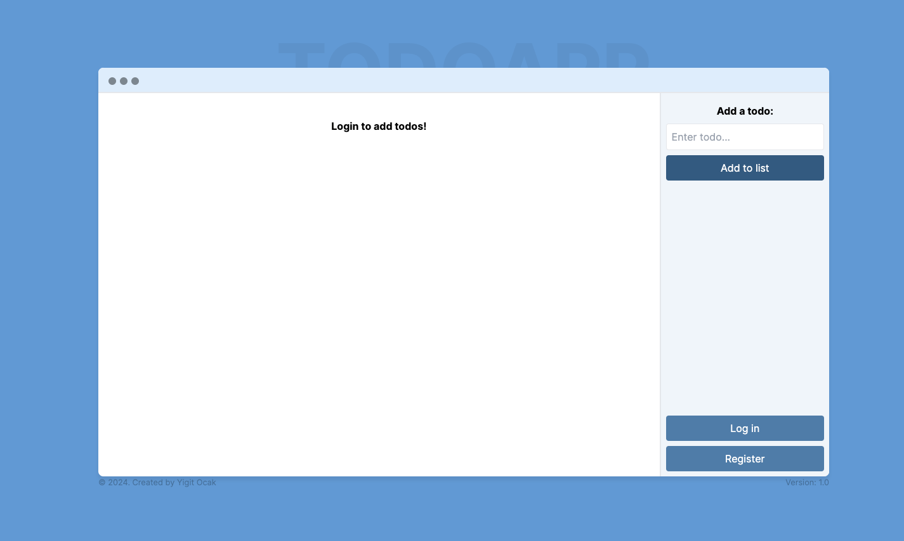

# Todo App (React, Vite, TypeScript)


## Overview

A responsive task management application focused on delivering an intuitive user experience. Built with React, Vite, and TypeScript for the frontend, and Node.js/Express for the backend, it supports real-time updates and state management.



## Features

- **Responsive Design:** Accessible across devices.
- **Task Management:** Create, delete, update, and view todos with real-time updates.
- **Strong REST API:** Efficient data handling and synchronization.
- **Real-Time Updates:** Instant updates with state management.

## Tech Stack

- **Frontend:** React, Vite, TypeScript, styled-components
- **Backend:** Node.js, Express.js, Knex.js
- **Database:** MySQL
- **Authentication:** JWT

## Getting Started

### Prerequisites

- Node.js
- MySQL

### Installation

1. **Clone the repository:**
    ```bash
    git clone https://github.com/yigitocak/Todo-App-Typescript.git
    cd Todo-App-Typescript
    ```

2. **Install dependencies for the server:**
    ```bash
    cd server
    npm install
    ```

3. **Install dependencies for the client:**
    ```bash
    cd client
    npm install
    ```

4. **Set up the database:**
   - Create a MySQL database and update the connection details in either `knexfile.js` or create a `.env` file in the server directory.

5. **Run the backend server:**
    ```bash
    cd server
    npm start
    ```

6. **Run the frontend in development mode:**
    ```bash
    cd client
    npm run dev
    ```

### Usage

- Navigate to `http://localhost:5173` to access the app.
- Use the interface to manage your tasks efficiently.

### Building for Production

1. **Build the client:**
    ```bash
    cd client
    npm run build
    ```

2. **Serve the built client:**
   The built files will be in the `dist` directory, ready to be served by a static file server.

## API Endpoints

### Todo

- **GET /:email**: Retrieve all user todos
- **POST /:email/add**: Create a new todo
- **DELETE /:email/delete/:todoId**: Delete a todo by ID
- **PUT /:email/complete/:todoId**: Complete a todo by ID

### Register

- **POST /register**: Create a new user

### Login

- **POST /login**: Login user
- **GET /login/auth**: Authenticate user

### Delete

- **DELETE /delete**: Delete user

## Contributing

Contributions are welcome! Feel free to fork the repository and make your improvements. Follow these steps:

1. Fork the repository.
2. Create a new branch (`git checkout -b feature-branch`).
3. Commit your changes (`git commit -m 'Add new feature'`).
4. Push to the branch (`git push origin feature-branch`).
5. Open a Pull Request.

## Contact

For any inquiries, please contact me at [yigitockk@gmail.com](mailto:yigitockk@gmail.com).